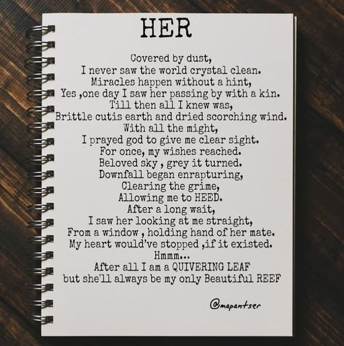

***<!--StartFragment-->***

***Covered by dust,*** 

***I never saw the world crystal clean.*** 

***Miracles happen without a hint,*** 

***Yes ,oe day I saw her passing by with a kin.*** 

***Till then all I knew was,*** 

***Brittle cutis earth and dried scorching wind.*** 

***With all the might,*** 

***I prayed god to give me clear sight.*** 

***For once, my wishes reached.*** 

***Beloved sky , grey it turned.*** 

***Downfall began enrapturing,*** 

***Clearing the grime,*** 

***Allowing me to HEED.*** 

***After a long wait,*** 

***I saw her looking at me straight,*** 

***From a window , holding hand of her mate.*** 

***My heart would’ve stopped ,if it existed.*** 

***Hmmm…*** 

***After all I am a QUIVERING LEAF*** 

***but she'll always be my only Beautiful REEF***

***<!--EndFragment-->***

